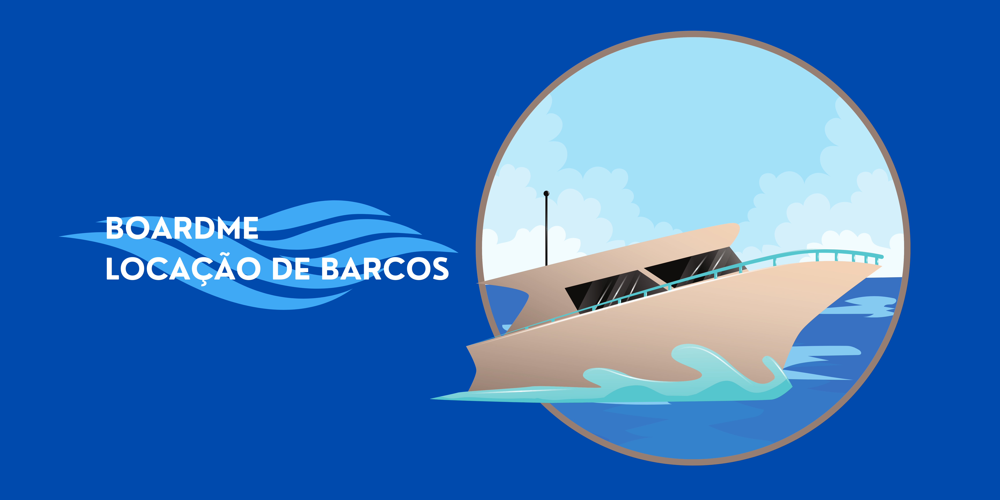
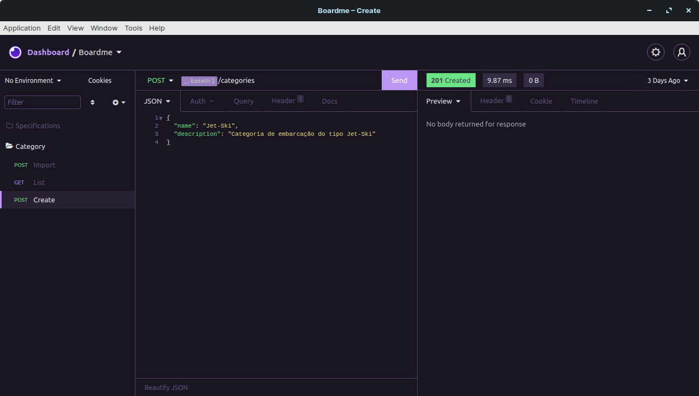

## Sobre
Boardme é uma API de locação de barcos.
## Instalação
Você precisa das seguintes ferramentas instaladas para executar este projeto:

[Node.js](https://nodejs.org/en/download/), [Yarn](https://yarnpkg.com/).

```bash
# Faça um clone
$ git clone https://github.com/Jacoappolinario/Boardme.git

# Navegue até o repositório clonado:
$ cd Boardme

# Baixe as dependências:
$ yarn install

# Divirta-se
$ yarn dev
```
## Screenshots



  
